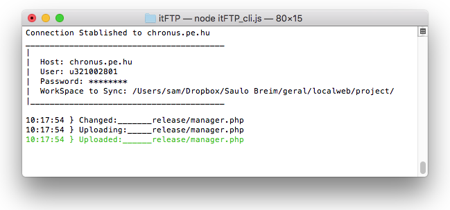
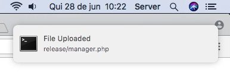
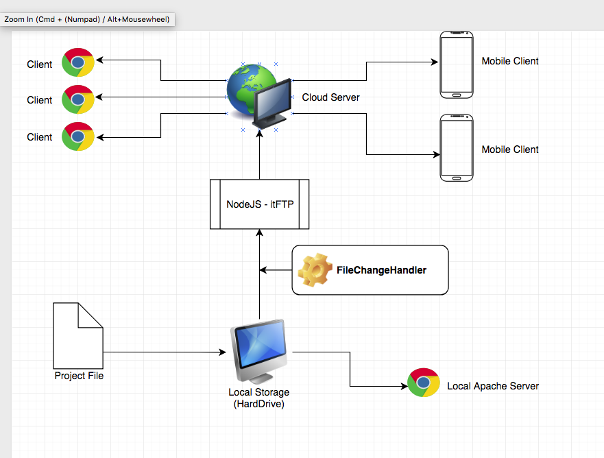

# itFTP
###### A tool to upload your project when you edit some file


#### Configuration
###### The file **configs.json** have the informations to connect with the Server, your default content is:
  ```
  {
    "host": "domain.com",
    "user": "username",
    "password": "password",
    "workspace": "/Users/sam/Dropbox/Saulo Breim/geral/localweb/project/",
    "exceptSpecificFiles": ["index.lock", "FETCH_HEAD", ".git", ".DS_Store", "node_modules", "lab"]
  }
  ```
######  _A future correction is to insert what the workspace to sync in configs.json_
  
#### Dependencies (node modules)
###### Most important node modules:
  1. [ftp](https://www.npmjs.com/package/ftp)
  2. [node-notifier](https://www.npmjs.com/package/node-notifier)
  
###### The dependencies can be installed with **npm** with this command lines inside the itFTP folder:
```
  $ npm install node-notifier
  $ npm install ftp
```
#### Project Gallery






Whatsapp [Contact](https://wa.me/559992854911) 

E-Mail Contact: absfregs@gmail.com
